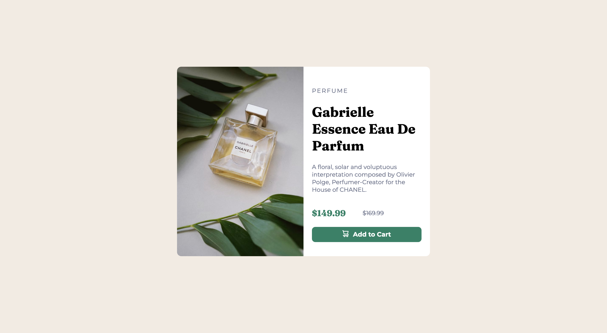
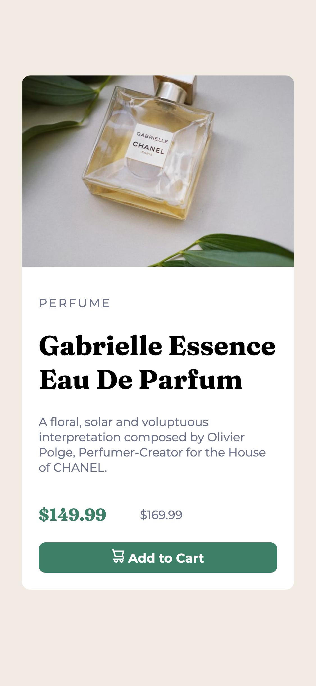

# Frontend Mentor - Product preview card component solution

This is a solution to the [Product preview card component challenge on Frontend Mentor](https://www.frontendmentor.io/challenges/product-preview-card-component-GO7UmttRfa). Frontend Mentor challenges help you improve your coding skills by building realistic projects. 

## Table of contents

- [Overview](#overview)
  - [The challenge](#the-challenge)
  - [Screenshot](#screenshot)
  - [Links](#links)
- [My process](#my-process)
  - [Built with](#built-with)
  - [What I learned](#what-i-learned)
  - [Useful resources](#useful-resources)
- [Author](#author)

## Overview

### The challenge

Users should be able to:

- View the optimal layout depending on their device's screen size
- See hover and focus states for interactive elements

### Screenshot




### Links

- [Solution URL](https://www.frontendmentor.io/solutions/responsive-product-preview-card-component-UbFXnXKH9A)
- [Live site URL](https://esgave.github.io/product-preview-card-component/)

## My process

### Built with

- Semantic HTML5 markup
- CSS custom properties
- Flexbox
- Media queries

### What I learned

- I gained a better understanding of Flexbox
- I explored CSS custom properties further 
- I learned how to display different images depending on the device's screen size

```html
 
 
```
```css
.img-desktop {
    display: none;
    max-width: 50%;
    border-radius: 10px 0px 0px 10px
}

.img-mobile {
    max-width: 100%;
    border-radius: 10px 10px 0px 0px
}

@media (min-width: 768px) {
    .container-parent {
        display: flex;
    }

    .container {
        display: flex;
        flex-direction: row;
    }

    .img-desktop {
        display: block;
    }

    .img-mobile {
        display: none;
    }
}
```

### Useful resources

- [A complete guide to flexbox](https://css-tricks.com/snippets/css/a-guide-to-flexbox/) 

## Author

- Frontend Mentor - [@esgave](https://www.frontendmentor.io/profile/esgave)